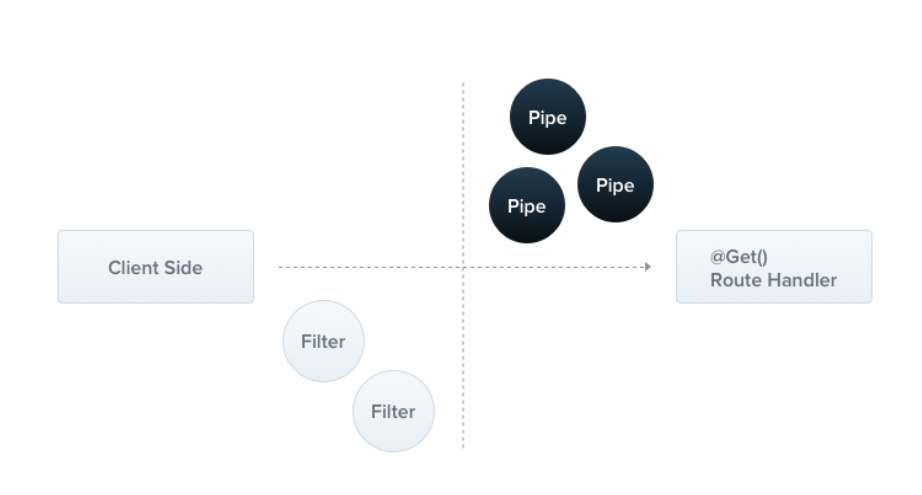

# NestJS
## Setup

```
# 글로벌에 NestJS CLI 설치 
$ npm i -g @nestjs/cli

# NestJS CLI로 새로운 프로젝트 생성
$ nest new project-name

# 설치 확인
$  nest --version
```

## Running the app
```
# development
$ npm run start

# watch mode
$ npm run start:dev

# production mode
$ npm run start:prod
```

## CLI's CRUD generator :  nest g resource [name]
```
# module 생성
$ nest g module board

# controller 생성
# --no-spec : 테스트를 위한 소스 코드 없이 생성 
$ nest g controller board --no-spec

# service 생성
$ nest g service board --no-spec

```

## npm Install 

```
# install class-validator class-transformer
$ npm install class-validator class-transformer 
```
    Options
    -P, --save-prod: Package will appear in your dependencies. (default) 

    -D, --save-dev: Package will appear in your devDependencies.

    -O, --save-optional: Package will appear in your optionalDependencies.

    --no-save: Prevents saving to dependencies.

    When using any of the above options to save dependencies to your package.json, there are two additional, optional flags:

    -E, --save-exact: Saved dependencies will be configured with an exact version rather than using npm's default semver range operator.

    -B, --save-bundle: Saved dependencies will also be added to your bundleDependencies list.

## Providers
- Nest의 기본 개념
- 대부분의 Nest 클래스는 프로바이더로 취급될 수 있음(services, repositories, factories, helpers 등)
- 프로바이더의 main idea는 종속성 주입이 가능하다는 것


## Decorators
- @Body() : 요청 객체의 속성 중 Body를 가지고 오기위해 사용
- @Param() : path variable 을 가져오기 위해 사용. 지정하지 않으면 전체를 다 받고 특정 변수를 가져올 때는 지정

## DTO(Data Transfer Object)
- 계층간 데이터 교환을 위한 객체
- 데이터가 네트워크를 통해 전송되는 방법을 정의하는 객체
- interface나 class를 이용해 정의 될 수 있음 => NestJS에서는 class 추천 

## Pipe  



- @Injectable() 데코레이터가 있는 클래스
- PipeTransform interface 를 구현해야 함
- Typical use cases

  - transformation: 입력된 데이터를 원하는 형식으로 변환
  - validation: 입력 데이터를 평가하여 유효한 경우 변경없이 전달, 유효하지않은 경우 예외 발생 시킴
    
    두 경우 모두 파이프틑 controller route handler 가 처리하는 인수에 대해서 작동. 
    파이프는 메소드를 호출 바로 직전에 파이프 삽입 -> 파이프틑 메서드를 대상으로 하는 인수를 수신하고 이에 대해 작동

- Binding Pipes
  - Handler scoped Pipes: @UsePipes() 응 이용해 사용. 모든 파라미터에 적용
    ```javascript
    @Post()
    @UsePipes(new JoiValidationPipe(createCatSchema))
    async create(@Body() createCatDto: CreateCatDto) {
        this.catsService.create(createCatDto);
    }
    ```

  - Parameter scoped Pipes: 특정한 파라미터에게만 적용되는 파이프
    ```javascript
    @Get(':id')
    async findOne(@Param('id', ParseIntPipe) id: number) {
        return this.catsService.findOne(id);
    }
    ```

  - Global scoped pipes: 애플리케이션 레벨의 파이프. 클라이언트에서 들어오는 모든 요청에 적용. main.ts 에 넣어서 사용
    ```javascript
    async function bootstrap() {
        const app = await NestFactory.create(AppModule);
        app.useGlobalPipes(new ValidationPipe());
        await app.listen(3000); 
    }

    bootstrap();
    ```

- Built-in pipes
  - ValidationPipe
  - ParseIntPipe
  - ParseFloatPipe
  - ParseBoolPipe
  - ParseArrayPipe
  - ParseUUIDPipe
  - ParseEnumPipe
  - DefaultValuePipe


## 

## Reference
https://docs.nestjs.com/  
https://docs.npmjs.com/cli/v7/commands/npm-install  
따라하면서 배우는 NestJS - John Ahn

